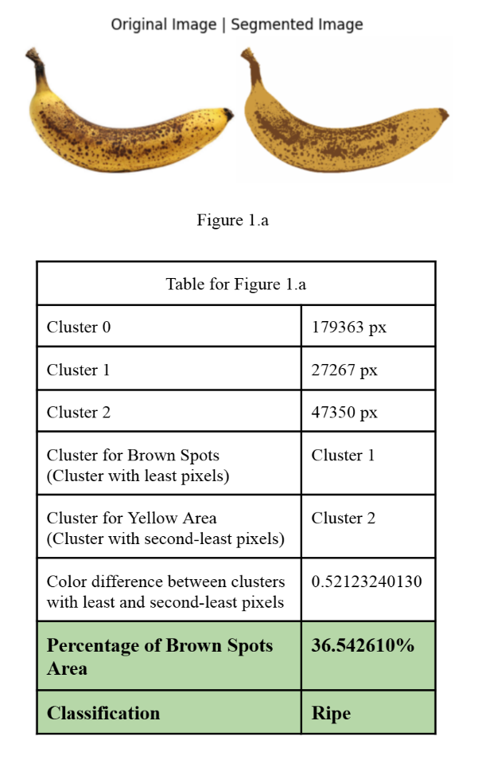
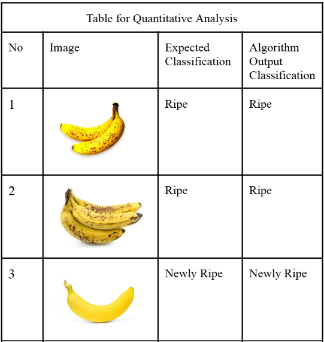

# Classification Algorithm of Banana Ripeness for Agriculture Sector

### ABOUT

This project tests an _image processing algorithm_ that categorizes banana images into the correct ripeness level.

 

### FEATURES & LIMITATIONS

The image processing algorithm has one main feature: breaks down a given banana image into three color clusters (background, "yellow" skin, "brown" spots) and calculate the amount of pixels each. Ripeness is then determined depending on the percentage of brown spot pixels. 

<table>
  <tr>
    <td></td>
    <td></td>
  </tr>
</table>

The algorithm is the simplest possible version of banana ripeness detection, where a homogenous background is highly desired for maximum effectiveness (see examples in `documentation/project-paper.pdf`).

 

### CODE & ARCHITECTURE

The two-part code consists of pre-processing methods followed by color segmentation process with K-Means clustering. To test the algorithm, the following types of banana images are run in code:
- dark or bright lighting
- single or multiple bananas
- with or without shadow
- many or minimal brown spots

 

### DEPLOYMENT

As a class final project, the algorithm is not deployed but presented to the lecturer. 